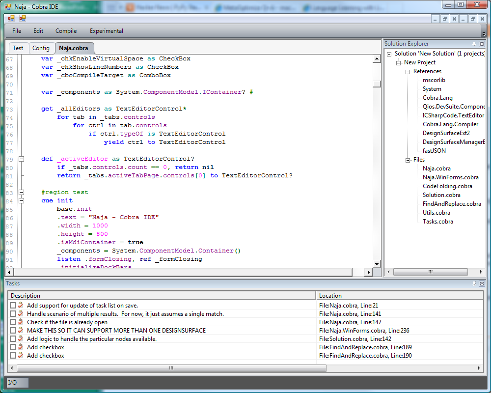
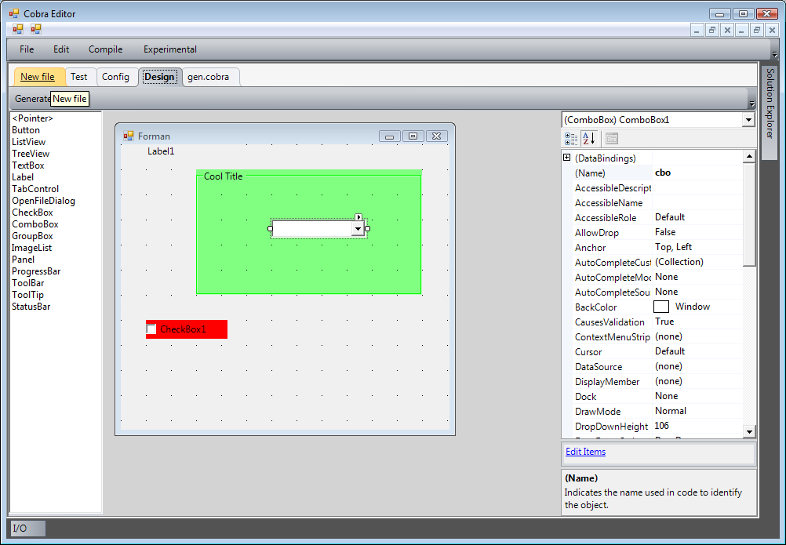

# cobraide2
Naja (a.k.a. Cobra IDE) is an Integrated Development Environment for the Cobra programming language (www.cobra-language.com).   Details may be found at http://cobra-language.com/forums/viewtopic.php?f=4&amp;t=745

# Version 0.1 Features include:
* Syntax Highlighting
* Code Folding
* Basic Project Support (Beta)
* TODO / Tasks display (Beta)
* Experimental GUI Designer.

*Update: 4/17/2012:*  Expect by end of May for there to be the first round of autocompletion support.

# Planned releases include:
* 0.2 - Code Crusher - _provide a test runner GUI for the builtin testing functionality of Cobra_
* 0.3 - Vapor - _behind the scenese release to refactor code base to support various front-ends/back-ends_
* 0.4 - Mastermind - _ autocompletion, improved navigation, documentation_
* 0.5 - Borg Drone - _plugin support, version control integration_

# Experimental (one-way, no loading support) Forms Designer:
* Currently only supports simple controls (no tabs)
* Currently only supports simple properties, even enums are *NOT* supported.

This is a duck tape and bailing wire feature at this point.  It will be ironed out in further releases.

# Dependencies:

The Cobra IDE uses the following components:
* QIOS DevSuite ([url:http://www.qiosdevsuite.com/Qios.WebSpace/Standard.aspx?RID=53]) An excellent - zero-cost UI library.  Unfortunately it is Windows Only.
* ICSharpCode.TextEditor with the Cobra.xshd from the SharpDevelop plugin compiled into it ([url:http://www.codeproject.com/KB/edit/TextEditorControl.aspx]).  The code also inspired some of the editor/menu handling.
* Cobra.xshd from the SharpDevelop plugin ([url:http://cobrapluginsd.codeplex.com/])
* fastJSON ([url:http://www.codeproject.com/KB/IP/fastJSON.aspx])
* Cobra Compiler ([url:http://www.cobra-language.com])
* UI Forms Designer ([url:http://www.codeproject.com/KB/miscctrl/DesignSurfaceManager_Ext.aspx])
